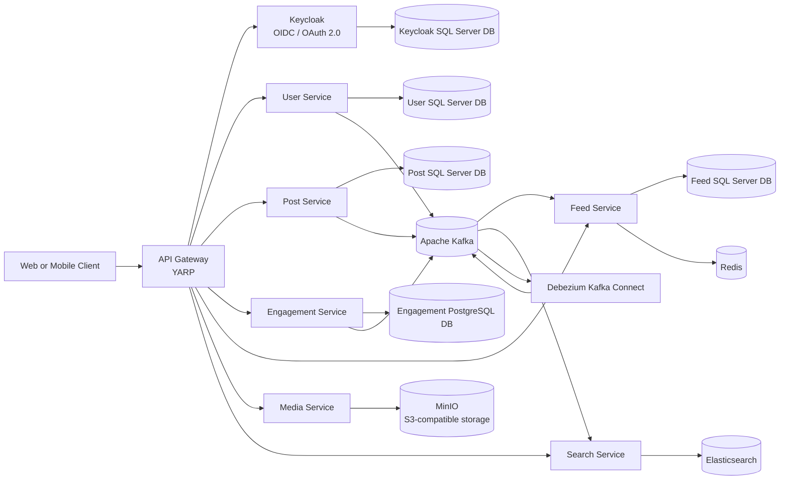

# LinkedIn Clone — Distributed Backend

A distributed backend for a LinkedIn-style social platform, built with **ASP.NET Core** and **.NET Aspire**.

The system is split into focused services for identity, users, posts, engagement, feeds, search, media, and API composition.

The main goal of this project is not only to reproduce social-network features, but also to demonstrate the architectural decisions required when a modular monolith grows into independently deployable services.

---

## Why This Project

The architecture is built around several practical principles:

- Keep identity and application profile data separate.
- Give each business capability a clear ownership boundary.
- Use synchronous APIs for immediate request/response operations.
- Use events for state propagation, indexing, integration, and background processing.
- Keep binary media outside relational databases and application servers.
- Support horizontal scaling without hiding operational trade-offs.
- Prefer read models that match query patterns instead of cross-service joins.
- Keep each service responsible for its own data and database schema.

---

# Architecture



## Main Data Flow

1. A client authenticates through **Keycloak** using OpenID Connect.
2. The **API Gateway** handles routing and authentication integration before forwarding requests to the appropriate service.
3. Each service persists data in its own database. Most services use SQL Server, while Engagement Service uses PostgreSQL.
4. Important domain changes are written to an **outbox table** within the same transaction as the business data.
5. **Debezium** captures committed outbox records through CDC and publishes them to Kafka.
6. Each service publishes events for changes within its own bounded context.
7. **Feed Service** consumes post, connection, reaction, and comment events to maintain Redis-backed feeds and counter read models.
8. **Search Service** consumes user, post, and comment events to maintain Elasticsearch read models.
9. **Media Service** generates short-lived presigned URLs so clients can upload and download files directly from MinIO.
10. Downstream services never read another service's database directly.

---

# Service Responsibilities

Each service owns its database schema and exposes data through APIs or events.

### User Service

Owns:

- User profiles
- Connections
- Experience
- Education
- Social graph data

It also reacts to Keycloak CDC events to provision application-level users and publishes profile and connection events consumed by other services.

### Post Service

Owns:

- Posts
- Reposts
- Mentions
- Hashtags
- Media references
- Post visibility

Reposts are represented as first-class posts so downstream services do not need separate logic for original posts versus reposts.

### Engagement Service

Owns:

- Reactions
- Comments
- Replies
- Engagement-related mentions

It owns validation and persistence rules for engagement operations and publishes events consumed by Feed, Search, and future Notification services.

Engagement Service does **not** directly update counters in Post Service. Counter read models are maintained by Feed Service from events.

### Feed Service

Owns:

- Feed entries
- Redis-backed user feeds
- Post counter read models

It is optimized for low-latency timeline reads and can scale independently from transactional write services.

### Search Service

Owns:

- Elasticsearch indexes
- Search-specific read models

It consumes events from User, Post, and Engagement services and maintains denormalized documents optimized for search queries.

### Media Service

Owns:

- Media upload/download policies
- Presigned URL generation
- MinIO access

Binary files are transferred directly between clients and object storage rather than through the API Gateway.

---

# Event-Driven Architecture

Cross-service **state propagation** is event-driven.

A service writes its business data and the corresponding event to an outbox table in the same database transaction.

Debezium captures the committed outbox record and publishes it to Kafka.

```text
Business Operation
       │
       ▼
Service Database
       │
       ├── Business Data
       │
       └── Outbox Message
                │
                ▼
             Debezium
                │
                ▼
              Kafka
                │
       ┌────────┼─────────┐
       ▼        ▼         ▼
     Feed     Search   Other Consumers
```

This provides reliable propagation without requiring the source service to synchronously call every downstream consumer.

> The outbox contains application-level business events. Debezium is responsible for reliably transporting committed outbox records to Kafka; it is not a replacement for domain-event design.

---

# Events

## User Service Events

### `UserProvisioned`

Published when a new application user is provisioned from Keycloak.

Contains:

- Internal user ID
- Keycloak ID
- Username
- Display name
- Email
- Creation timestamp

Consumed by services that maintain local user projections.

### `UserProfileUpdated`

Published when profile information changes.

Contains:

- User ID
- Display name
- Profile image
- Headline

Consumed by Post, Feed, Engagement, and Search services.

### `ConnectionRequestSent`

Published when a connection request is created.

### `ConnectionAccepted`

Published when a connection request is accepted.

Feed and graph projections can use this event to expand the recipient's feed and update connection relationships.

### `ConnectionRemoved`

Published when an existing connection is removed.

Consumers remove or update the corresponding relationship in their read models.

---

## Post Service Events

### `PostCreated`

Published for every new post, including original posts, pure reposts, and quote reposts.

Contains:

- Post ID
- Author ID
- Content
- Visibility
- Optional `RepostOfPostId`
- Mentioned user IDs
- Hashtags
- Creation timestamp

Feed Service uses it for fan-out, while Search Service uses it for indexing.

### `PostUpdated`

Published when an existing post is edited.

The event includes the updated post information, previous mentions, and change flags so consumers can determine whether the update is relevant to them.

### `PostDeleted`

Published when a post is soft-deleted.

Consumers remove or invalidate the corresponding read models.

---

## Engagement Service Events

### `ReactionAdded`

Published when a user reacts to a post or comment.

Contains:

- Reaction ID
- Target type
- Target ID
- User ID
- Reaction type
- Timestamp

Feed Service updates the corresponding counter.

### `ReactionChanged`

Published when a user changes their existing reaction.

The event includes both the previous and new reaction types.

Because the total reaction count does not change, Feed Service does not increment or decrement the counter.

### `ReactionRemoved`

Published when a user removes a reaction.

Feed Service decrements the corresponding counter.

### `CommentCreated`

Published when a user creates a comment or reply.

Contains:

- Comment ID
- Post ID
- Author ID
- Optional parent comment ID
- Content
- Mentioned user IDs
- Timestamp

Feed Service updates the post's comment counter, while Search Service can index the comment content.

### `CommentUpdated`

Published when a comment is edited.

Contains the updated content and previous mentions so downstream consumers can determine what changed.

### `CommentDeleted`

Published when a comment is removed.

Consumers remove or invalidate the corresponding read models.

---

## Media Service Events

### `MediaUploaded`

Published after a client confirms that an upload to MinIO completed.

Contains:

- Object key
- Content type
- Size
- Owner ID

Primarily useful for auditing and orphaned-object cleanup.

### `MediaDeleted`

Published when an object is removed from MinIO.

Consumers can remove stale media references or treat missing media as unavailable.

---

# Event Topics and Consumer Groups

Each service writes events to its own outbox table.

For example:

```text
postService.dbo.OutboxMessages
```

Debezium publishes the outbox records to the corresponding Kafka topic.

Consumers use independent consumer groups:

```text
feed-service-posts
search-service-posts
```

Each consumer group maintains its own offsets, allowing Feed and Search services to consume the same event stream independently.

The general naming convention is:

```text
<service-name>-<purpose>
```

---

# Idempotency

Kafka and Debezium provide **at-least-once delivery**, so consumers must be idempotent.

The project uses several patterns:

- Unique constraints on natural keys.
- Event IDs as deduplication keys.
- Upserts for projection updates.
- Absolute Redis writes where possible instead of unsafe increments.
- Inbox/deduplication tables for operations that cannot naturally be made idempotent.

For example, an external side effect such as sending an email should be protected by an inbox or deduplication mechanism keyed by the event ID.

---

# Event Versioning

Events are contracts between services.

The project follows two main rules:

1. **Add fields instead of removing or changing existing fields.**
2. Introduce a new event version only when a change is incompatible.

Deprecated fields remain available until all consumers stop depending on them.

For incompatible changes, a new event type/version is introduced while consumers migrate from the old contract.

---

# Technology Stack

| Area | Technology | Responsibility |
|---|---|---|
| Runtime | .NET 9 / ASP.NET Core | Service implementation and HTTP APIs |
| Orchestration | .NET Aspire | Local distributed application orchestration and service discovery |
| Edge | YARP | Routing, authentication integration, rate limiting, and API composition |
| Identity | Keycloak | OIDC/OAuth 2.0, users, roles, sessions, and tokens |
| Relational Data | SQL Server | Primary transactional storage |
| Engagement Database | PostgreSQL | Engagement Service transactional storage |
| ORM | Entity Framework Core | Persistence, migrations, and transaction handling |
| Messaging | Apache Kafka | Durable event streaming |
| CDC | Debezium | Outbox change capture and Kafka publishing |
| Cache / Hot State | Redis | Feed sorted sets and counter read models |
| Search | Elasticsearch | Search indexes and read models |
| Object Storage | MinIO | S3-compatible media storage |
| API | Carter / OpenAPI | Lightweight endpoint modules and API documentation |

---

# Technology Decisions

## Why Keycloak Instead of ASP.NET Core Identity?

Keycloak was selected because identity is treated as a platform capability rather than business logic owned by User Service.

| Keycloak | ASP.NET Core Identity |
|---|---|
| Dedicated identity server | Embedded application identity framework |
| OIDC/OAuth 2.0 built in | Requires additional protocol and hosting decisions |
| Centralized realm, client, role, session, and token management | Greater control inside the .NET application |
| Works well across multiple services and clients | Excellent for a single ASP.NET application |
| Realm export/import simplifies local environments | Usually requires custom administration and migration workflows |

ASP.NET Core Identity would still be a valid choice for a modular monolith. Keycloak fits this architecture because authentication remains outside business services and follows standard identity protocols.

## Why Not Auth0?

Auth0 is a strong managed alternative and can reduce identity infrastructure operations.

Keycloak was selected because it provides:

- Self-hosting
- Open-source software
- Local reproducibility
- Control over identity data and configuration
- Lower infrastructure cost during development

A managed provider such as Auth0 may be more appropriate when reducing identity infrastructure operations is the primary goal.

---

## Why Kafka Instead of RabbitMQ?

Kafka is used because the project treats events as a durable stream rather than only transient work items.

| Kafka | RabbitMQ |
|---|---|
| Durable append-only log | Queue-oriented message broker |
| Replayable event history | Strong task/work distribution model |
| Independent consumer groups | Rich routing and exchange model |
| Natural partitioning | Flexible routing keys |
| Strong fit for CDC and projections | Strong fit for commands and background jobs |

Kafka also integrates naturally with the Debezium CDC pipeline and allows Feed and Search projections to be rebuilt from event history.

RabbitMQ would still be a reasonable choice for task-oriented background processing.

---

## Why Debezium?

Debezium is used to reliably move committed outbox records into Kafka.

This provides:

- Reliable propagation after database commits.
- Reduced coupling between producers and consumers.
- A standardized CDC pipeline.
- The ability to support future auditing and integrations.

Debezium should not be considered a replacement for domain events.

The application still defines the business meaning of each event; Debezium handles reliable change capture and transport.

---

## Why Elasticsearch?

Elasticsearch provides a dedicated read model for search-heavy workloads.

It supports:

- Full-text search
- Relevance scoring
- Analyzed fields
- Filtering
- Denormalized search documents
- Independent scaling of search workloads

Transactional databases remain the source of truth.

Elasticsearch can be rebuilt from the event stream, so search-specific requirements do not dictate the transactional schema.

---

## Why MinIO?

MinIO provides an S3-compatible object-storage boundary for images and other media.

Benefits include:

- Suitable storage for large binary objects.
- Direct client uploads/downloads using presigned URLs.
- Independent scaling from transactional databases.
- Compatibility with AWS S3 and other S3-compatible providers.

Media Service controls access and URL generation without exposing storage credentials to clients.

---

## Why Redis for Feeds and Counters?

Feed reads are significantly more frequent than feed writes, so Feed Service maintains hot read models in Redis.

Redis provides:

- Sorted sets for timeline ordering.
- Hashes for counters and metadata.
- Fast range queries.
- Atomic operations for concurrent updates.

Redis is not the source of truth.

If Redis is lost, the feed and counter models can be rebuilt from service data and events.

---

## Why a Dedicated Feed Service?

Feed generation and counter maintenance have a different scaling profile from transactional writes.

Post and Engagement services optimize for correct writes.

Feed Service optimizes for low-latency timeline reads.

Separating them allows the read path to scale independently and enables different strategies for:

- Fan-out
- Caching
- Sharding
- Feed rebuilding
- Counter materialization

---

## Why a Single Engagement Service?

Reactions and comments are different entities, but they participate in the same engagement workflow.

They share:

- Validation rules
- Author/context checks
- Counter updates
- Notification behavior
- Event-stream requirements

Keeping them together simplifies ownership and avoids unnecessary service boundaries while still separating engagement from Post Service.

---

## Why .NET Aspire?

.NET Aspire provides a code-first local topology for the distributed application.

It simplifies:

- Service discovery
- Resource configuration
- Dependency management
- Health visibility
- Logs
- Traces
- Local orchestration

Docker Compose remains available as an infrastructure-oriented alternative.

The two definitions should remain aligned as the project evolves.

---

# Future Direction: Graph Database

Connections are currently stored relationally inside User Service.

This works well for:

- Direct connections
- Connection lists
- Basic relationship queries

More complex queries such as:

- Mutual connections
- Friends of friends
- Degrees of separation
- Graph-based feed signals

can become increasingly expensive in a relational database.

The planned approach is to add a graph **read model**, rather than replacing User Service.

```text
User Service
     │
     │ Connection Events
     ▼
   Kafka
     │
     ▼
Graph Projection
     │
     ▼
Neo4j / JanusGraph
```

The responsibilities remain:

- User Service remains the source of truth.
- Connection events populate the graph projection.
- The graph database handles traversal-heavy queries.
- Feed and Search can consume graph-derived signals without querying User Service tables.

The decision to introduce a graph database should be based on measured query requirements rather than anticipated scale.

---

# Database and Connection Pooling Roadmap

The current local environment uses SQL Server for most services and PostgreSQL for Engagement Service.

EF Core uses the underlying ADO.NET connection pools.

As replicas and services increase, connection management becomes important to prevent connection storms.

The planned approach is to:

- Set deliberate maximum connection-pool sizes.
- Monitor active connections and pool exhaustion.
- Add database proxies or poolers when appropriate.
- Apply timeouts and retry policies consistently.
- Monitor query duration and deadlocks.
- Keep read-heavy workloads on Redis and Elasticsearch where appropriate.
- Load-test database boundaries before production scaling.

The exact pooling or proxy technology should be selected based on measured load and deployment requirements.

---

# Repository Structure

```text
.
├── APIGateway/          Edge routing, OIDC integration, and gateway policies
├── AppHost/             .NET Aspire application topology
├── EngagementService/   Comments, replies, reactions, and engagement events
├── FeedService/         Feed entries, Redis fan-out, and counter read models
├── MediaService/        Presigned URLs and S3-compatible storage access
├── PostService/         Posts, reposts, mentions, hashtags, and post events
├── SearchService/       Kafka consumers and Elasticsearch read models
├── ServiceDefaults/     Shared ASP.NET/Aspire defaults and observability
├── UserService/         Profiles, connections, persistence, and user events
├── docker-compose.yml   Local infrastructure alternative
└── LinkedIn Clone.sln  Visual Studio solution
```

Services follow a feature-oriented structure where possible.

Database migrations stay with the service that owns the corresponding database, while consumers remain close to the read model they materialize.

---

# Getting Started

## Prerequisites

- .NET 9 SDK
- Docker Desktop with Linux containers enabled
- Git
- At least 8 GB of available memory for the local infrastructure stack

## Configuration

Configure the required local environment values for:

- SQL Server
- PostgreSQL
- Kafka
- Elasticsearch
- Keycloak
- Redis
- MinIO

Do not commit:

- Real passwords
- Client secrets
- Access keys
- Production connection strings

Check each service's `appsettings.Development.json` and local environment configuration before starting the application.

---

# Run with .NET Aspire

From the repository root:

```bash
dotnet restore "LinkedIn Clone.sln"
dotnet run --project AppHost/AppHost.csproj
```

Open the Aspire dashboard URL printed by AppHost.

The dashboard provides:

- Service topology
- Logs
- Endpoints
- Resource health
- Distributed application diagnostics

---

# Build the Solution

```bash
dotnet build "LinkedIn Clone.sln"
```

Development OpenAPI documents are exposed by individual services when running in the Development environment.

---

# Local Development Endpoints

Ports may change when services are launched through Aspire.

The following are the stable ports used by the local infrastructure definitions:

| Component | URL |
|---|---|
| Keycloak | `http://localhost:8082` |
| Kafka | `localhost:9092` / `localhost:9094` |
| Kafka UI | `http://localhost:8080` / `http://localhost:8088` |
| Debezium Connect | `http://localhost:8083` |
| Debezium UI | `http://localhost:8085` |
| Schema Registry | `http://localhost:8081` |
| Elasticsearch | `http://localhost:9200` |
| Kibana | `http://localhost:5601` |
| SQL Server | `localhost:14330` |
| PostgreSQL | `localhost:5432` |
| Redis | `http://localhost:6969` |
| MinIO API | `http://localhost:9000` |
| MinIO Console | `http://localhost:9001` |

---

# Production Considerations

The local environment intentionally uses single-node resources and development-friendly configuration.

Before production, the platform should add:

- TLS and authentication for Kafka, Elasticsearch, Redis, MinIO, and Debezium.
- Managed secrets or a dedicated secret manager.
- Multi-node Kafka and Elasticsearch deployments.
- Appropriate Kafka replication factors.
- Highly available SQL Server and PostgreSQL deployments.
- Tested backup and restore procedures.
- Idempotent Kafka consumers.
- Retry and dead-letter handling.
- Event compatibility and versioning.
- Outbox retention policies.
- Debezium connector monitoring.
- Resource limits and health probes.
- Structured logging, tracing, and metrics.
- Database connection-pool limits based on load testing.
- CI checks for builds, migrations, API contracts, and container vulnerabilities.

---

# Roadmap

- Complete end-to-end outbox and Debezium configuration for Post and Engagement services.
- Add event schemas and compatibility rules through Schema Registry.
- Add idempotency and dead-letter handling to Kafka consumers.
- Complete Feed Service fan-out for posts, reactions, and comments.
- Add a Neo4j or JanusGraph projection for the connection graph.
- Add automated integration tests for SQL Server, PostgreSQL, Kafka, Elasticsearch, Redis, and MinIO.
- Add production-grade observability dashboards and alerts.
- Add database connection-pool protection and load testing.
- Add deployment manifests and environment-specific configuration.

---

# Architecture Principles

```text
                    ┌─────────────────────┐
                    │      Clients        │
                    └──────────┬──────────┘
                               │
                               ▼
                    ┌─────────────────────┐
                    │    YARP Gateway     │
                    └──────────┬──────────┘
                               │
          ┌────────────────────┼────────────────────┐
          ▼                    ▼                    ▼
   User / Post /       Engagement / Feed       Media / Search
      Services              Services              Services
          │                    │                    │
          └────────────────────┼────────────────────┘
                               │
                               ▼
                            Kafka
                               │
             ┌─────────────────┼─────────────────┐
             ▼                 ▼                 ▼
           Feed             Search            Other
        Projections       Projections        Consumers
             │                 │
             ▼                 ▼
           Redis         Elasticsearch
```

The core architectural idea is:

**Transactional services own their data, Kafka propagates committed business events, and specialized read models optimize workloads that require different access patterns.**

This keeps service boundaries explicit while allowing the platform to evolve from a modular application into independently scalable services.
