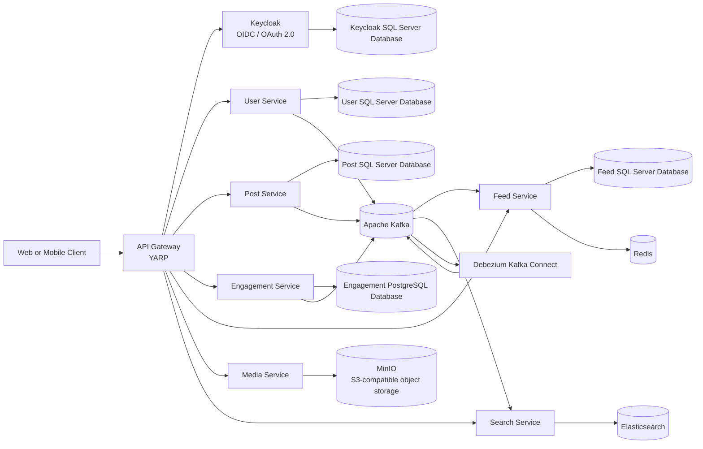

A distributed backend for a LinkedIn-style social platform, built with ASP.NET Core and .NET Aspire. The system is split into focused services for identity, users, posts, engagement, feeds, search, media, and API composition.

The main goal of this project is not only to reproduce social-network features, but also to demonstrate the architectural decisions required when a modular monolith grows into independently deployable services.

## Why This Project

This project is designed around a few practical principles:

- Keep identity and application profile data separate.
- Give each business capability a clear ownership boundary.
- Use synchronous APIs for immediate request/response operations.
- Use events for propagation, indexing, integration, and background work.
- Keep binary media outside relational databases and application servers.
- Choose infrastructure that can support horizontal scaling without hiding the operational trade-offs.
- Prefer read models that match the query shape over joins that cross service boundaries.

## Architecture



### Main data flow

1. A client authenticates through Keycloak using OpenID Connect.
2. The API Gateway validates the session and forwards requests to the appropriate service.
3. Most services persist transactional data in their own SQL Server databases, while Engagement Service uses PostgreSQL for its own domain data using EF Core migrations.
4. Important changes are written to an outbox and published through Kafka using Debezium.
5. Post and Engagement services emit their own events independently of one another.
6. Feed Service consumes post, reaction, and comment events from the Engagement stream, maintains Redis-backed feeds, and materializes counters close to the read path.
7. Search Service consumes user, post, and comment events and maintains Elasticsearch read models.
8. Media Service generates short-lived presigned URLs so clients upload and download files directly from MinIO.

## Service Responsibilities

Each service owns its database schema and exposes data through APIs or events. No service reads another service's tables directly.

**User Service** owns profiles, connections, experience, education, and the social graph. It reacts to Keycloak CDC events to provision users and publishes profile events that other services consume as projections.

**Post Service** owns posts, media references, mentions, hashtags, and reposts. It treats reposts as first-class posts so downstream services never need to understand the difference between an original post and a repost.

**Engagement Service** owns reactions, comments, and replies. It publishes reaction and comment events, keeps the validation and persistence rules for engagement content in one place, and never mutates counters in Post Service directly — the counter model lives in Feed Service and is updated from events.

**Feed Service** owns feed entries, Redis-backed sorted sets per user, and the counter read model for posts. It is the fastest path for anything the client renders in a timeline.

**Search Service** owns Elasticsearch indexes and consumes user, post, and comment events to maintain searchable read models.

**Media Service** owns presigned URL generation and access policy for MinIO. It never streams binary data through the gateway.

## Events

Everything that changes state across services happens through events. A service writes to its own database and, in the same transaction, appends an event to its outbox table. Debezium captures that row through CDC and publishes it to Kafka. Downstream services consume the event and update their own read models.

This is the only mechanism by which data crosses service boundaries. No service calls another to "notify" it of a change, and no service reads another service's tables.

The events below are grouped by the service that publishes them.

### User Service Events

**`UserProvisioned`** is published when a new user is first observed through Keycloak CDC. It carries the internal user id, Keycloak id, username, display name, email, and creation timestamp. Feed Service and Post Service use it to seed their local user projections.

**`UserProfileUpdated`** is published when a user changes their display name, profile image, or headline. It carries the user id and the new profile fields. Post Service, Feed Service, Engagement Service, and Search Service all consume it to keep their user summary projections current.

**`ConnectionRequestSent`** is published when a user sends a connection request. Feed Service consumes it as a signal for potential feed expansion, and future graph projections consume it to update the connection graph.

**`ConnectionAccepted`** is published when a connection request is accepted. Feed Service uses it to start including the newly connected user's posts in the recipient's feed. Graph projections update the connection edge.

**`ConnectionRemoved`** is published when a connection is removed on either side. Feed Service removes the corresponding posts from the affected feeds, and graph projections remove the edge.

### Post Service Events

**`PostCreated`** is published for every new post, including pure reposts and quote reposts. It carries the post id, author id, content, visibility, an optional `RepostOfPostId`, mentioned user ids, hashtags, and creation timestamp. Feed Service uses it to fan out to followers and update counters. Search Service indexes it. Notification Service uses it to notify mentioned users.

**`PostUpdated`** is published when an existing post is edited. It carries the same shape as `PostCreated` plus the previous mentioned user ids and a set of change flags. The change flags let consumers decide whether the event is relevant to them: Search Service only re-indexes when content or hashtags change, and Notification Service only notifies newly mentioned users.

**`PostDeleted`** is published when a post is soft-deleted. It carries the post id, author id, and deletion timestamp. Feed Service removes the post from all affected feeds in Redis. Search Service removes the document from its index. Notification Service marks related notifications as stale.

### Engagement Service Events

**`ReactionAdded`** is published when a user reacts to a post or comment. It carries the reaction id, target type (post or comment), target id, user id, reaction type, and timestamp. Feed Service increments the appropriate counter in Redis. Notification Service notifies the target author when the reactor is not the author.

**`ReactionChanged`** is published when a user changes their reaction type on the same target (for example, from Like to Love). It carries the same fields as `ReactionAdded` plus the previous reaction type. Feed Service does not change counters because the count is unchanged; Notification Service may or may not act on it depending on product rules.

**`ReactionRemoved`** is published when a user removes their reaction. It carries the reaction id, target, user id, and timestamp. Feed Service decrements the counter.

**`CommentCreated`** is published when a user posts a comment or reply. It carries the comment id, post id, author id, parent comment id (for replies), content, mentioned user ids, and timestamp. Feed Service increments the post's comment counter. Search Service indexes comment content if comment search is enabled. Notification Service notifies the post author and any mentioned users.

**`CommentUpdated`** is published when a comment is edited. It carries the same shape plus the previous mentioned user ids. Notification Service notifies newly mentioned users only.

**`CommentDeleted`** is published when a comment is removed. It carries the comment id, post id, author id, and deletion timestamp. Feed Service decrements the counter, and Search Service removes the document.

### Media Service Events

**`MediaUploaded`** is published when a client confirms that an upload to MinIO completed. It carries the object key, content type, size, and owner id. This event is mostly used for auditing and cleanup of orphaned objects.

**`MediaDeleted`** is published when an object is removed from MinIO. Post Service and Engagement Service treat missing media as an empty reference rather than an error.

### Feed Service Events

Feed Service is primarily a consumer. It publishes very little of its own. When it does emit an event, it is typically a maintenance signal rather than a domain fact. For example, a future `FeedRebuildRequested` event would let operators trigger a targeted rebuild of a user's feed without touching Post or Engagement services.

### Search Service Events

Search Service does not publish domain events. It owns read models only and can be rebuilt from the events produced by other services. If Search Service needs to signal that an index rebuild is complete, that signal is operational, not domain.

## Event Naming and Topics

Every outbox row becomes a Kafka message on the topic corresponding to the service that produced it. The topic prefix is the service name, and the table name is the outbox table for that service.

For example, the Post Service writes to `postService.dbo.OutboxMessages`. Debezium tails that table and publishes to a Kafka topic named `postService.dbo.OutboxMessages`. Every consumer that wants post events subscribes to that topic with a distinct consumer group id.

Consumer group ids follow the pattern `<service-name>-<purpose>`. Feed Service consumes post events under the group `feed-service-posts`, and Search Service consumes them under `search-service-posts`. Each group has its own offset, so neither service is affected by the other's processing speed.

## Idempotency

Kafka and Debezium together give at-least-once delivery. Every consumer must therefore be idempotent. The patterns used in this project are:

- Unique constraints on natural keys, so repeated inserts fail silently or upsert.
- Deduplication keys derived from the event id, so replays are no-ops.
- Redis operations designed to be idempotent, such as `ZADD` with the same score and `HSET` with an absolute value rather than an increment when the increment would double-count.

When a consumer cannot make an operation idempotent — for example, an external email — the operation is moved behind a separate deduplication layer, such as an inbox table with a unique message id.

## Event Versioning

Events are contracts between services. Once a consumer depends on a field, removing it or changing its meaning breaks the consumer silently. The project follows two rules:

Fields are added, not removed. If a field must be removed, it is deprecated first and removed only after every consumer has stopped reading it.

A new event version is introduced only for incompatible changes. Incompatible changes are rare, and when they happen they are published as a new event type rather than mutating the existing one. Consumers that still need the old type keep consuming it until they are upgraded.

## Technology Stack

| Area                 | Technology                                | Responsibility                                                                 |
| -------------------- | ----------------------------------------- | ------------------------------------------------------------------------------ |
| Runtime              | .NET 9 / ASP.NET Core                     | Service implementation and HTTP APIs                                           |
| Orchestration        | .NET Aspire                               | Local distributed application orchestration and service discovery              |
| Edge                 | YARP API Gateway                          | Routing, authentication integration, rate limiting, and request composition    |
| Identity             | Keycloak                                  | OIDC/OAuth 2.0, users, roles, sessions, and tokens                             |
| Relational data      | SQL Server + PostgreSQL (Engagement only) | Core service data is on SQL Server; Engagement Service uses PostgreSQL         |
| Graph data (planned) | Neo4j or JanusGraph                       | Connection graph traversal and mutual-connection queries                       |
| ORM                  | Entity Framework Core                     | Persistence, migrations, and transaction handling                              |
| Messaging            | Apache Kafka                              | Durable event streaming between services                                       |
| Change data capture  | Debezium                                  | Capturing database changes without coupling every integration to business code |
| Cache and hot state  | Redis                                     | Distributed cache, feed sorted sets, and counter read models                   |
| Search               | Elasticsearch                             | Full-text and profile/post/comment search read models                          |
| Object storage       | MinIO                                     | S3-compatible storage for profile and post media                               |
| API style            | Carter / OpenAPI                          | Lightweight endpoint modules and API documentation                             |

## Technology Decisions

### Why Keycloak instead of ASP.NET Core Identity?

We chose Keycloak because identity is a platform capability in this architecture, not a feature that should be reimplemented inside the User Service.

| Keycloak                                                                            | ASP.NET Core Identity                                                                    |
| ----------------------------------------------------------------------------------- | ---------------------------------------------------------------------------------------- |
| Dedicated identity server with OIDC and OAuth 2.0 built in                          | Identity is embedded in an application and usually needs extra hosting and protocol work |
| Centralized realm, client, role, session, and token management                      | More control inside the .NET codebase, but more responsibility for the team              |
| Works well when multiple services or future clients need the same identity provider | Excellent for a single ASP.NET application or a tightly integrated identity database     |
| Realm export/import makes local environments reproducible                           | Usually requires custom administration and migration workflows                           |

ASP.NET Core Identity would be a valid choice for a modular monolith. Keycloak is a better fit here because it keeps authentication concerns outside business services and gives future web, mobile, and third-party clients a standard protocol boundary.

### Why not Auth0?

Auth0 is a strong managed option and can reduce operational work. Keycloak was selected here because it is self-hosted, open source, locally reproducible, and gives the project control over data location, realm configuration, and development costs. Auth0 may be preferable when the priority is minimizing identity infrastructure operations rather than retaining self-hosting control.

### Why Kafka instead of RabbitMQ?

Kafka is used because the project treats events as a durable stream that can be replayed by new consumers, not only as transient work items.

| Kafka                                                                 | RabbitMQ                                                              |
| --------------------------------------------------------------------- | --------------------------------------------------------------------- |
| Durable append-only log with replayable history                       | Message broker optimized for queues and routing                       |
| Multiple consumer groups can independently read the same event stream | Excellent for work distribution and task-oriented messaging           |
| High throughput and natural partitioning by aggregate key             | Rich exchange, routing-key, and per-message delivery semantics        |
| A good foundation for search projections, feed fan-out, and CDC       | Often the simpler choice for commands, jobs, and low-volume workflows |

For this system, Kafka also provides the event backbone required by Debezium and allows Feed and Search services to rebuild projections. RabbitMQ would be a reasonable alternative for background jobs, but Kafka better matches the event-streaming direction of this project.

### Why Debezium?

Application events describe business intent; database changes describe committed state. Debezium captures committed row-level changes from the source databases through CDC and publishes them to Kafka, with Engagement Service using PostgreSQL while the remaining services continue on SQL Server.

This gives us:

- Reliable propagation of changes after a database transaction commits.
- Less coupling between a database-owning service and every downstream consumer.
- The ability to bootstrap or rebuild downstream projections from change events.
- A standard CDC pipeline that can later serve analytics, auditing, or integrations.

Debezium is not a replacement for business events. Domain events should still be produced when consumers need business meaning. CDC is most useful when consumers need an accurate stream of persisted changes.

### Why Elasticsearch instead of searching directly in SQL Server or PostgreSQL?

Elasticsearch is a dedicated read model for search-heavy workloads:

- Full-text search, analyzed fields, relevance scoring, and filtering.
- Independent scaling of search workloads from transactional writes.
- Denormalized documents optimized for the query shape of profiles, posts, and comments.
- Event-driven updates without making every search query join multiple service databases.

The transactional databases remain the source of truth. Elasticsearch can be rebuilt from Kafka events, so search availability and indexing speed do not need to dictate the transactional schema.

### Why MinIO instead of storing files in the service databases?

MinIO provides an S3-compatible object-storage boundary for images and other media.

- Object storage is cheaper and more appropriate for large binary content than database rows.
- Presigned URLs let clients transfer files directly without streaming them through the API Gateway.
- Media storage scales independently from user and post data.
- S3 compatibility keeps the migration path open to AWS S3 or another object-storage provider.

The Media Service owns URL generation and access policy; the application does not expose storage credentials to clients.

### Why PostgreSQL specifically for Engagement Service?

Engagement data combines reactions, comments, mentions, and reply hierarchies in a way that benefits from PostgreSQL's transactional consistency, rich querying, and flexible relational model. The service keeps its own database schema and exposes data through APIs or events rather than allowing other services to query its tables directly.

The rest of the platform remains on SQL Server unless a service has a clear requirement for a different database technology.

### Why Redis for feeds and counters?

Reactions and comments generate a high rate of counter updates that never need to be transactional. Feed Service keeps them in Redis hashes and sorted sets so reads never touch the database for hot data.

- Sorted sets hold each user's feed with a stable ordering by creation time.
- Atomic increments keep reaction and comment counts accurate under concurrency.
- The read path for a timeline becomes a small Redis range query, not a join across Post, Reaction, and Comment databases.

Redis is not the source of truth. It can be rebuilt from Kafka events and the service databases if it fails.

### Why a dedicated Feed Service?

Feed generation, fan-out, and counter maintenance have a different scaling profile from writes. Post and Engagement services care about correctness under writes. Feed Service cares about low-latency reads for every timeline request.

Splitting them means the read path can be scaled, cached, and eventually sharded independently of the write path.

### Why a single Engagement Service?

Reactions and comments look different at the domain level, but they are part of the same engagement workflow on a post or comment. They share validation patterns, author-context rules, notification behavior, and counter updates, so consolidating them keeps ownership boundaries simpler without losing separation from the Post Service.

A single Engagement Service makes it easier to reason about the activity model, consume a single event stream for feed counters, and evolve the schema for interactions without having to coordinate two independent services.

### Why .NET Aspire?

Aspire provides a code-first local topology for the services and infrastructure dependencies. It gives the team service discovery, dependency references, health visibility, logs, traces, and a dashboard without requiring every developer to manually coordinate ports and startup order.

Docker Compose remains available as a more portable infrastructure-only option. The two definitions should be kept aligned as the project evolves.

## Future Direction: Graph Database for Connections

The connection graph is currently modeled in User Service using relational tables. This works well for direct connections, follow lists, and mutual-connection lookups at small scale.

As the graph grows, queries like "mutual connections between two users", "degrees of separation", and "friends of friends who liked this post" become expensive in a relational store. These are graph traversal problems, and they map naturally to a graph database such as Neo4j or JanusGraph.

The plan is not to replace User Service. It is to add a graph read model that is populated from the same connection events that already flow through Kafka.

- User Service remains the source of truth for connections.
- A graph projection service subscribes to `ConnectionCreated`, `ConnectionAccepted`, and `ConnectionRemoved` events.
- The graph store answers traversal-heavy queries such as mutual connections and short-path discovery.
- Feed and Search services can query the graph projection for "friends of friends" signals without touching User Service.

This keeps the write model stable and moves the graph workload to infrastructure that is designed for it. No service reads another service's tables, and the graph store is just another read model that can be rebuilt from events.

The decision to add it should be driven by measured query latency, not by anticipation.

## Database and Connection Pooling Roadmap

The current local setup uses SQL Server for most service-owned data and PostgreSQL specifically for Engagement Service. Connection strings are supplied through configuration, and EF Core manages connections through the underlying ADO.NET pool.

As the number of services and replicas grows, the database layer will eventually need a connection-management strategy that protects the platform from connection storms across both database engines. The planned direction is:

- Use bounded connection pools per service and tune `Max Pool Size` deliberately.
- Add a database proxy or pooler where the chosen engine supports it.
- Apply timeouts, retry policies, circuit breakers, and health checks consistently.
- Monitor active connections, pool exhaustion, query duration, and deadlocks.
- Keep read-heavy workloads on dedicated read models such as Elasticsearch and Redis instead of opening more transactional connections.

The exact future database or pooler choice should be driven by measured load and deployment constraints, not by adding a second database technology prematurely.

## Repository Structure

```text
.
|-- APIGateway/         Edge routing, OIDC session handling, and gateway policies
|-- AppHost/            .NET Aspire application topology and infrastructure resources
|-- EngagementService/  Comments, replies, reactions, mentions, and engagement events
|-- FeedService/        Feed entries, Redis fan-out, and counter read models
|-- MediaService/       Presigned upload/download URLs and S3-compatible storage access
|-- PostService/        Posts, reposts, mentions, hashtags, transactions, and post events
|-- SearchService/      Kafka consumers and Elasticsearch indexes/read models
|-- ServiceDefaults/    Shared ASP.NET/Aspire defaults and observability setup
|-- UserService/        Profiles, connections, user persistence, and user events
|-- docker-compose.yml  Local infrastructure alternative
|-- LinkedIn Clone.sln  Visual Studio solution
```

Services follow a feature-oriented structure where possible. Database migrations stay with the service that owns the data, and consumers stay close to the service that materializes their read model.

## Getting Started

### Prerequisites

- .NET 9 SDK
- Docker Desktop with Linux containers enabled
- Git
- At least 8 GB of available memory for the local infrastructure stack

### Configuration

Create or update the local environment values required by the compose file and local services. Do not commit real passwords, client secrets, access keys, or production connection strings.

The repository currently uses configuration sections for service URLs, SQL Server connections, PostgreSQL for Engagement Service, Kafka bootstrap servers, Elasticsearch, Keycloak, Redis, and S3-compatible storage. Check each service's `appsettings.Development.json` before starting it.

### Run with .NET Aspire

From the repository root:

```bash
dotnet restore "LinkedIn Clone.sln"
dotnet run --project AppHost/AppHost.csproj
```

Open the Aspire dashboard URL printed by the AppHost. It exposes the local service topology, logs, endpoints, and resource health.

### Build the solution

```bash
dotnet build "LinkedIn Clone.sln"
```

Development OpenAPI documents are exposed by the individual services when they run in the Development environment.

## Local Development Endpoints

Ports can change when running through Aspire. The following are the stable ports declared in the local infrastructure definitions:

| Component        | URL                                                                              |
| ---------------- | -------------------------------------------------------------------------------- |
| Keycloak         | `http://localhost:8082`                                                          |
| Kafka            | `localhost:9092` or `localhost:9094`, depending on the runner                    |
| Kafka UI         | `http://localhost:8080` with Docker Compose, `http://localhost:8088` with Aspire |
| Debezium Connect | `http://localhost:8083`                                                          |
| Debezium UI      | `http://localhost:8085`                                                          |
| Schema Registry  | `http://localhost:8081`                                                          |
| Elasticsearch    | `http://localhost:9200`                                                          |
| Kibana           | `http://localhost:5601`                                                          |
| SQL Server       | `localhost:14330`                                                                |
| PostgreSQL       | `localhost:5432`                                                                 |
| Redis            | `http://localhost:6969` with Docker Compose                                      |
| MinIO API        | `http://localhost:9000`                                                          |
| MinIO Console    | `http://localhost:9001`                                                          |

## Production Considerations

The local environment intentionally uses single-node resources, development-friendly images, and disabled local Elasticsearch security. Before production, the platform should add:

- TLS and authentication for Kafka, Elasticsearch, Redis, MinIO, and Debezium.
- Managed secrets or a dedicated secret manager instead of environment-file secrets.
- Multi-node Kafka and Elasticsearch with appropriate replication factors.
- High-availability SQL Server and PostgreSQL deployment patterns, with tested backup and restore procedures for each database.
- Idempotent consumers, dead-letter handling, retry policies, and event versioning.
- Outbox retention and Debezium connector monitoring.
- Resource limits, health probes, structured logs, traces, and metrics.
- Database connection-pool limits based on load tests.
- CI checks for build, migrations, API contracts, and container image vulnerabilities.

## Roadmap

- Complete the end-to-end outbox and Debezium connector configuration for Post and Engagement services.
- Add event schemas and compatibility rules through Schema Registry.
- Add idempotency and dead-letter handling to Kafka consumers.
- Complete Feed Service fan-out for posts, reactions, and comments.
- Add a Neo4j or JanusGraph projection for the connection graph driven by User Service events.
- Add automated integration tests for SQL Server, PostgreSQL, Kafka, Elasticsearch, Redis, and MinIO flows.
- Add production-grade observability dashboards and alerts.
- Add connection-pool protection and load-test the database boundaries.
- Add deployment manifests and environment-specific configuration.

```

```
